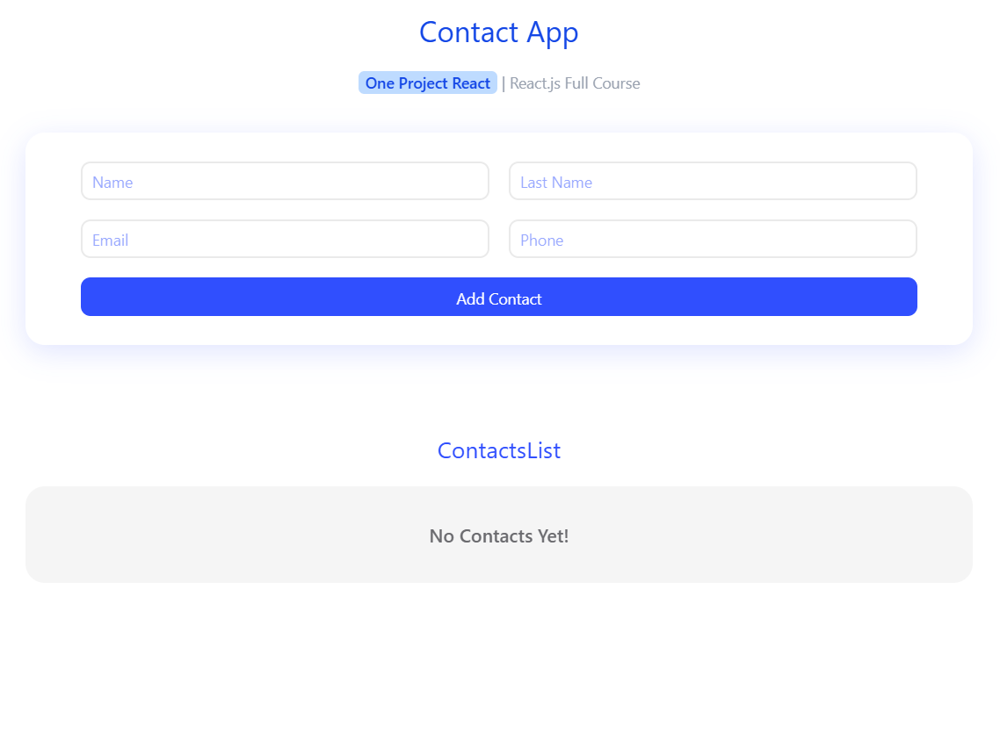
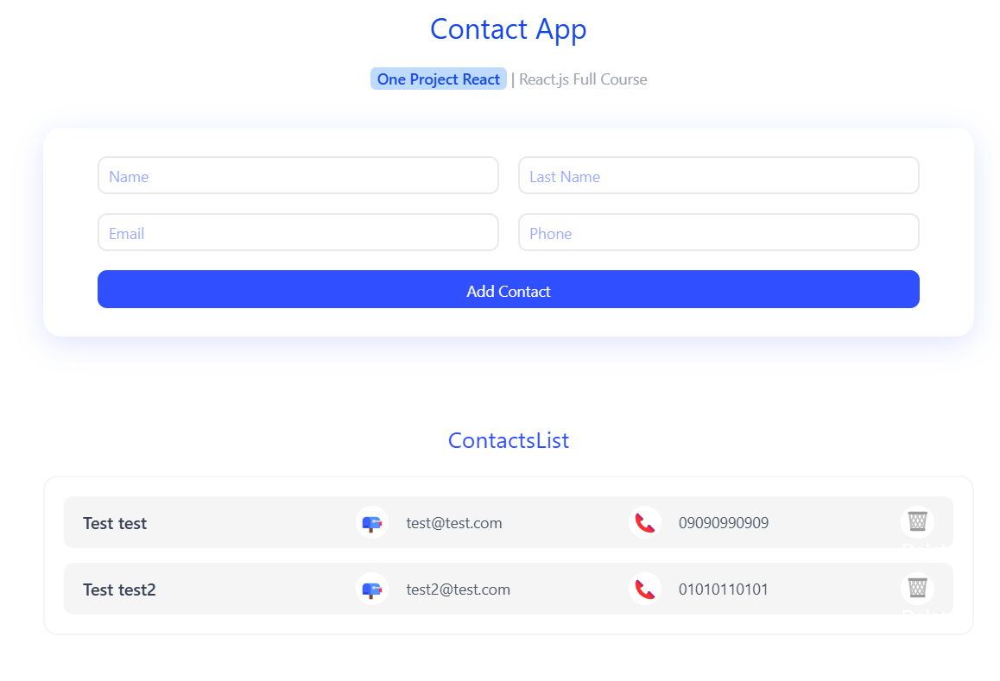

# ContactApp 📇  

This is a simple contact management app built using **ReactJS**. It is designed as a **test and educational project**, aimed at practicing and learning the fundamental concepts of React. Users can enter their contact details, which are stored locally and displayed in the app.  

⚠️ **Note:** This project is purely for **learning and testing** purposes. It is **not intended for real-world or commercial use**.  

## ✨ Features:  
- This app includes **four input fields**:  
  1. **First Name**  
  2. **Last Name**  
  3. **Email Address**  
  4. **Phone Number**  

- User data is **stored locally**, ensuring persistence even after refreshing the page.  
- If no data is entered, an **error message** is displayed.  
- Once valid data is provided, the default `"NoContact"` placeholder is replaced with the user's details.  

## 🚀 How It Works:  
1. The user fills out the form with contact details.  
2. If the form is **empty**, an error message appears.  
3. Once valid data is entered, the UI updates with the new contact details.  
4. Data is saved locally, ensuring it remains even after a page refresh.  
5. Before any data is entered, a `"NoContact"` placeholder is shown.  

## 🛠 Technologies Used:  
- **ReactJS ⚛️**  
- **Styled Components 🎨**  
- **React Icons 🎭**  
- **Tailwind CSS 🌊**  

## 📸 Screenshots:  

  
  

## 🔗 Follow Me:  
- [Instagram](https://www.instagram.com/matinhasanpour_)  
- [Telegram](https://t.me/mattinhasanpour)  

---

📢 **Disclaimer:** This project is strictly for educational purposes and is not suitable for production use. Feel free to contact me if you have any questions or suggestions!  

